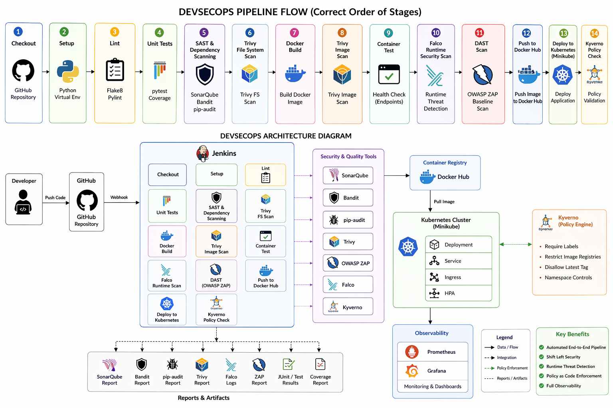

# 🚀 DevSecOps Pipeline – Secure Task App


---

This project implements a full DevSecOps pipeline for a Flask banking application,
including CI/CD, security scanning, Kubernetes deployment, and runtime monitoring.
Every `git push` to `main` runs the entire pipeline automatically.

---

## 🏗️ Architecture Overview

<p align="center">
  
</p>

---

## 🔄 Pipeline Flow

1. Code pushed to GitHub
2. Jenkins triggers pipeline
3. Linting (Flake8, Pylint)
4. Unit testing (pytest + coverage)
5. SAST (SonarQube, Bandit)
6. Dependency scan (pip-audit)
7. Trivy filesystem scan
8. Docker build
9. Trivy image scan
10. Container runtime test
11. Falco runtime security monitoring
12. DAST scan (OWASP ZAP)
13. Push image to Docker Hub
14. Deploy to Kubernetes (Minikube)
15. Kyverno policy enforcement check

---

## 📸 Pipeline Preview

<p align="center">
  
</p>

---

## 📦 Stack

| Layer | Tool |
|---|---|
| CI/CD | Jenkins |
| Code quality | Flake8, Pylint |
| Testing | pytest + coverage |
| SAST | SonarQube Community, Bandit |
| Dependency audit | pip-audit |
| Container scanning | Trivy (filesystem + image) |
| DAST | OWASP ZAP baseline |
| Runtime security | Falco (custom rules, no-driver mode) |
| Policy enforcement | Kyverno (ClusterPolicies) |
| Containerisation | Docker |
| Orchestration | Minikube (Kubernetes) |
| Monitoring | Prometheus + Grafana |

---

## 🖥️ Requirements

- Ubuntu 22.04 or 24.04
- 4 CPU cores (8 recommended)
- 8 GB RAM minimum (16 GB recommended)
- 50 GB free disk
- Internet access

---

## ⚙️ Install everything (one shot)

Copy the entire block and paste it into a terminal.

```bash
sudo apt update && sudo apt upgrade -y
sudo apt install -y curl wget git unzip apt-transport-https \
  ca-certificates gnupg lsb-release openjdk-17-jdk

# Docker
curl -fsSL https://get.docker.com -o get-docker.sh
sudo sh get-docker.sh
sudo usermod -aG docker $USER
newgrp docker

# kubectl
curl -LO "https://dl.k8s.io/release/v1.35.1/bin/linux/amd64/kubectl"
sudo install kubectl /usr/local/bin/kubectl && rm kubectl

# Minikube
curl -LO https://storage.googleapis.com/minikube/releases/latest/minikube-linux-amd64
sudo install minikube-linux-amd64 /usr/local/bin/minikube && rm minikube-linux-amd64

# Helm
curl https://raw.githubusercontent.com/helm/helm/main/scripts/get-helm-3 | bash

# SonarScanner
wget -q https://binaries.sonarsource.com/Distribution/sonar-scanner-cli/sonar-scanner-cli-6.0.0.4432-linux.zip
unzip -q sonar-scanner-cli-6.0.0.4432-linux.zip
sudo mv sonar-scanner-6.0.0.4432-linux /opt/sonar-scanner
echo 'export PATH="/opt/sonar-scanner/bin:$PATH"' >> ~/.bashrc
source ~/.bashrc

# Jenkins
curl -fsSL https://pkg.jenkins.io/debian-stable/jenkins.io-2023.key \
  | sudo tee /usr/share/keyrings/jenkins-keyring.asc > /dev/null
echo "deb [signed-by=/usr/share/keyrings/jenkins-keyring.asc] \
  https://pkg.jenkins.io/debian-stable binary/" \
  | sudo tee /etc/apt/sources.list.d/jenkins.list > /dev/null
sudo apt update && sudo apt install -y jenkins
sudo systemctl enable --now jenkins

# Trivy
wget -qO - https://aquasecurity.github.io/trivy-repo/deb/public.key | sudo apt-key add -
echo "deb https://aquasecurity.github.io/trivy-repo/deb $(lsb_release -sc) main" \
  | sudo tee /etc/apt/sources.list.d/trivy.list
sudo apt update && sudo apt install -y trivy

# ngrok (for GitHub webhooks)
wget -q https://bin.equinox.io/c/bNyj1mQVY4c/ngrok-v3-stable-linux-amd64.tgz
tar xzf ngrok-v3-stable-linux-amd64.tgz
sudo mv ngrok /usr/local/bin/ && rm ngrok-v3-stable-linux-amd64.tgz

# Helm repos
helm repo add prometheus-community https://prometheus-community.github.io/helm-charts
helm repo add falcosecurity       https://falcosecurity.github.io/charts
helm repo add kyverno              https://kyverno.github.io/kyverno/
helm repo update

echo "Done. Log out and back in (or run 'newgrp docker') before continuing."
```

> ⚠️ After the script finishes, **log out and back in** (or run `newgrp docker`) so Docker works without `sudo`.

---

## 📥 Clone the repo

```bash
git clone https://github.com/Mohamed-Aziz-Aguir/devsecops-github-test.git
cd devsecops-github-test
```

---

## 🐳 Start core services

### SonarQube

```bash
docker run -d --name sonarqube --restart unless-stopped \
  -p 9000:9000 \
  -e SONAR_ES_BOOTSTRAP_CHECKS_DISABLE=true \
  sonarqube:community
```

Wait about 60 seconds then open `http://localhost:9000`.
Default credentials: `admin / admin` — you will be asked to change the password on first login.

---

### 🛡️ Minikube

```bash
minikube start --driver=docker --cpus=4 --memory=6g
kubectl get nodes   # should show 1 node Ready
```

---

### 🧱 Jenkins

Jenkins is already running as a systemd service. Get the initial admin password:

```bash
sudo cat /var/lib/jenkins/secrets/initialAdminPassword
```

Open `http://localhost:8080`, paste the password, install suggested plugins, and create an admin user.

---

## 🧩 Install Kubernetes tools

Run these once after Minikube is up. Only needs to be repeated if you run `minikube delete`.

### Prometheus + Grafana

```bash
helm install prometheus prometheus-community/kube-prometheus-stack \
  -n monitoring --create-namespace
kubectl get pods -n monitoring -w   # wait until all Running
```

### Kyverno

```bash
helm install kyverno kyverno/kyverno \
  -n kyverno --create-namespace \
  --set replicaCount=1
kubectl get pods -n kyverno -w      # wait until all Running
```

Apply the three policies from this repo:

```bash
kubectl apply -f k8s/kyverno/
kubectl get clusterpolicy           # all three should show READY=true
```

---

## ⚠️ Required integrations — do this before running the pipeline

### SonarQube token

1. In SonarQube (`http://localhost:9000`), go to **Administration → Security → Users → admin → Tokens**
2. Generate a token named `jenkins-token` and copy it
3. In Jenkins: **Manage Jenkins → Credentials → System → Global credentials → Add Credentials**
   - Kind: Secret text
   - ID: `sonar-token`
   - Secret: the token you copied

### Docker Hub

Add a second credential:
- Kind: Username with password
- ID: `Docker-Hub`
- Username: your Docker Hub username
- Password: a Docker Hub access token (hub.docker.com → Account Settings → Security → New Access Token)

### SonarQube server in Jenkins

Go to **Manage Jenkins → System → SonarQube servers → Add**:

- Name: `sonarqube`
- Server URL: `http://<your-machine-LAN-IP>:9000`

  > ⚠️ Use the machine's LAN IP (e.g. `192.168.1.x`), **not** `localhost`. Jenkins runs as a system service and `localhost` does not resolve correctly from it.

- Server authentication token: select `sonar-token`

### Required plugins

Go to **Manage Jenkins → Plugins → Available** and install:

- SonarQube Scanner
- Pipeline: Stage View
- Timestamper
- Email Extension
- HTML Publisher

### 📧 Email notifications

The pipeline sends an email on every build result. Without this step the pipeline will error at the notification stage.

1. Go to **Manage Jenkins → Configure System → Extended E-mail Notification**
2. Set:
   - SMTP server: `smtp.gmail.com` (or your provider)
   - Port: `587`
   - Use TLS: ✅
   - Username: your email address
   - Password: an **App Password** — not your real account password
     (Gmail: myaccount.google.com → Security → App passwords)
3. Click **Test configuration** before saving

### (Optional) GitHub webhook via ngrok

```bash
ngrok http 8080
```

Copy the HTTPS URL, then:
- In Jenkins: **Manage Jenkins → Configure System → Jenkins Location → Jenkins URL** — paste the ngrok URL
- In your GitHub repo: **Settings → Webhooks → Add webhook**
  - Payload URL: `<ngrok-url>/github-webhook/`
  - Content type: `application/json`
  - Event: Just the push event

---

## 🚀 Run the pipeline

1. In Jenkins, **New Item → Pipeline**, name it `devsecops-pipeline`
2. Pipeline definition: **Pipeline script from SCM**
3. SCM: Git → Repository URL: `https://github.com/Mohamed-Aziz-Aguir/devsecops-github-test.git`
4. Branch: `*/main`
5. Script Path: `Jenkinsfile`
6. **Save → Build Now**

---

## 🌐 Access the app

```bash
minikube service secure-task-service -n devsecops --url
```

Or get the URL in one command:

```bash
echo "http://$(minikube ip):$(kubectl get svc secure-task-service \
  -n devsecops -o jsonpath='{.spec.ports[0].nodePort}')"
```

Open the URL in a browser. The landing page is public — create an account to use deposits, withdrawals, and transfers.

---

## 🧪 Test Falco

Trigger a shell inside the running container to fire the detection rule:

```bash
kubectl exec -it -n devsecops deploy/secure-task-app -- /bin/sh
```

Then check the logs:

```bash
kubectl logs -n falco -l app.kubernetes.io/name=falco | grep "Shell spawned"
```

During a pipeline run, Falco output is archived as `falco-reports/falco-output.log` in the Jenkins build artifacts.

---

## 📊 Monitoring

### Grafana

```bash
kubectl port-forward -n monitoring svc/prometheus-grafana 3000:80
```

Open `http://localhost:3000` — login: `admin`, password:

```bash
kubectl get secret -n monitoring prometheus-grafana \
  -o jsonpath="{.data.admin-password}" | base64 -d && echo
```

### Prometheus

```bash
kubectl port-forward -n monitoring svc/prometheus-operated 9090:9090
```

Open `http://localhost:9090`

---

## 🔁 After a reboot

Jenkins and SonarQube start automatically. Run these to bring the rest back up:

```bash
# Kubernetes cluster
minikube start --driver=docker --cpus=4 --memory=6g

# SonarQube (persists as a named Docker container)
docker start sonarqube

# Check Jenkins is running
sudo systemctl status jenkins

# Optional: port-forward dashboards in the background
kubectl port-forward -n monitoring svc/prometheus-grafana 3000:80 &
kubectl port-forward -n monitoring svc/prometheus-operated 9090:9090 &

# Verify all cluster pods
kubectl get pods -A | grep -E "monitoring|falco|kyverno|devsecops"
```

---

## 📁 Project structure

```
.
├── app/
│   └── app.py                  # Flask app — UI + API in one file
├── tests/                      # pytest unit tests
├── docker/
│   └── Dockerfile
├── falco/
│   └── custom_rules.yaml       # Falco rules used during pipeline scan
├── k8s/
│   ├── deployment.yaml
│   ├── service.yaml
│   ├── ingress.yaml
│   ├── hpa.yaml
│   └── kyverno/
│       ├── require-labels.yaml
│       ├── restrict-image-registries.yaml
│       └── add-namespace-label.yaml
├── Jenkinsfile
├── requirements.txt
├── requirements-dev.txt
├── sonar-project.properties
└── README.md
```

---

## 🧹 Cleanup

Stop everything without deleting anything:

```bash
minikube stop
docker stop sonarqube
sudo systemctl stop jenkins
```

Full teardown:

```bash
minikube delete
docker rm -f sonarqube
helm uninstall prometheus -n monitoring
helm uninstall kyverno -n kyverno
sudo systemctl disable --now jenkins
```

---

## ❗ Common problems

**Deploy fails with a Kyverno webhook error**

Your `k8s/deployment.yaml` or `k8s/service.yaml` is missing required labels. Both files need `app.kubernetes.io/name` and `environment` on `metadata.labels`, and the Deployment also needs them on `spec.template.metadata.labels`.

**Pods stuck at `0/2` after deploy**

The app expects a PostgreSQL connection on startup. Without a database pod in the cluster it will crash. Either add a PostgreSQL deployment or set `FLASK_ENV=testing` in the Deployment env vars to fall back to SQLite.

**`minikube service` returns connection refused**

Run `kubectl get pods -n devsecops`. If the status is `CrashLoopBackOff`, check logs:

```bash
kubectl logs -n devsecops deployment/secure-task-app
```

**Jenkins cannot reach SonarQube at `localhost:9000`**

Use the machine's LAN IP when registering the SonarQube server in Jenkins, not `localhost`. Jenkins runs as the `jenkins` system user and the two don't share the same network context.

**HPA shows `unknown` for CPU**

```bash
minikube addons enable metrics-server
```

**Kyverno pods stuck in Pending**

The default chart deploys 3 replicas with anti-affinity rules that cannot be satisfied on a single Minikube node. Reinstall with `--set replicaCount=1`.

---

## 🎯 What this project demonstrates

- Full CI/CD pipeline triggered automatically on every push
- Multiple security layers covering code, dependencies, containers, runtime, and admission control
- Kubernetes-native policy enforcement with Kyverno
- Observability with Prometheus and Grafana
- A practical end-to-end DevSecOps workflow from commit to running pod

---

## 👤 Author

**Mohamed Aziz Aguir**  
DevSecOps & Cybersecurity Engineer
