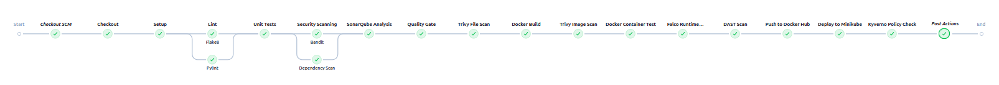

# 🚀 DevSecOps Pipeline – Secure Task App


---

This project implements a full DevSecOps pipeline for a Flask application,
including CI/CD, security scanning, Kubernetes deployment, and monitoring.

------------------------------------------------------------------------

## 🏗️ Architecture Overview

<p align="center">
  
</p>

------------------------------------------------------------------------

## 🔄 Pipeline Flow

1. Code pushed to GitHub
2. Jenkins triggers pipeline
3. Linting (Flake8, Pylint)
4. Unit testing (pytest + coverage)
5. SAST (SonarQube, Bandit)
6. Dependency scan (pip-audit)
7. Trivy filesystem scan
8. Docker build
9. Trivy image scan
10. Container runtime test
11. Falco runtime security monitoring
12. DAST scan (OWASP ZAP)
13. Push image to Docker Hub
14. Deploy to Kubernetes (Minikube)
15. Policy enforcement (Kyverno)

------------------------------------------------------------------------

## 📸 Pipeline Preview

<p align="center">
  
</p>

------------------------------------------------------------------------
## 📦 Stack Used

-   CI/CD: Jenkins
-   Code Quality: Flake8, Pylint
-   Testing: pytest
-   SAST: SonarQube, Bandit
-   Dependency Scan: pip-audit
-   Container Scan: Trivy
-   DAST: OWASP ZAP
-   Runtime Security: Falco
-   Kubernetes Security: Kyverno
-   Containerization: Docker
-   Orchestration: Minikube (Kubernetes)
-   Monitoring: Prometheus + Grafana

------------------------------------------------------------------------

## 🖥️ Requirements

-   Ubuntu 22.04 / 24.04
-   8 GB RAM minimum (16 GB recommended)
-   4 CPU cores
-   Docker + internet access

------------------------------------------------------------------------

## ⚙️ Install Everything (one shot)

```bash
sudo apt update && sudo apt upgrade -y
sudo apt install -y curl wget git unzip apt-transport-https ca-certificates gnupg lsb-release

# Docker
curl -fsSL https://get.docker.com -o get-docker.sh
sudo sh get-docker.sh
sudo usermod -aG docker $USER
newgrp docker

# kubectl
curl -LO "https://dl.k8s.io/release/v1.35.1/bin/linux/amd64/kubectl"
sudo install kubectl /usr/local/bin/kubectl && rm kubectl

# Minikube
curl -LO https://storage.googleapis.com/minikube/releases/latest/minikube-linux-amd64
sudo install minikube-linux-amd64 /usr/local/bin/minikube && rm minikube-linux-amd64

# Helm
curl https://raw.githubusercontent.com/helm/helm/main/scripts/get-helm-3 | bash

# Java (for SonarQube)
sudo apt install -y openjdk-17-jdk

# Jenkins
curl -fsSL https://pkg.jenkins.io/debian-stable/jenkins.io-2023.key | sudo tee /usr/share/keyrings/jenkins-keyring.asc > /dev/null
echo "deb [signed-by=/usr/share/keyrings/jenkins-keyring.asc] https://pkg.jenkins.io/debian-stable binary/" | sudo tee /etc/apt/sources.list.d/jenkins.list > /dev/null
sudo apt update
sudo apt install -y jenkins
sudo systemctl enable --now jenkins

# Trivy
wget -qO - https://aquasecurity.github.io/trivy-repo/deb/public.key | sudo apt-key add -
echo deb https://aquasecurity.github.io/trivy-repo/deb $(lsb_release -sc) main | sudo tee /etc/apt/sources.list.d/trivy.list
sudo apt update
sudo apt install -y trivy
```

------------------------------------------------------------------------

## 📥 Clone Project

``` bash
git clone https://github.com/Mohamed-Aziz-Aguir/devsecops-github-test.git
cd devsecops-github-test
```

------------------------------------------------------------------------

## 🐳 Start Services

### SonarQube

``` bash
docker run -d --name sonarqube -p 9000:9000 -e SONAR_ES_BOOTSTRAP_CHECKS_DISABLE=true sonarqube:community
```

------------------------------------------------------------------------

### Minikube

``` bash
minikube start --driver=docker --cpus=4 --memory=6g
```

------------------------------------------------------------------------

### Jenkins

Open: http://localhost:8080

## ⚠️ Required Integrations (DO THIS FIRST)

Before running the pipeline, make sure everything is properly configured:

- Generate a **SonarQube token** and add it in Jenkins (`sonar-token`)
- Add your **Docker Hub credentials** in Jenkins (`Docker-Hub`)
- Connect **GitHub → Jenkins** (webhook or manual trigger)
- Configure **SonarQube server in Jenkins** (URL + token)

### 📧 Email Notifications (Required)

This pipeline sends email notifications on success/failure.

Configure it in Jenkins:

1. Go to **Manage Jenkins → Configure System**
2. Find **Extended E-mail Notification**
3. Set:
   - SMTP server (example: Gmail → `smtp.gmail.com`)
   - Port: `587`
   - Use TLS: ✅
   - Username: your email
   - Password: **App Password** (not your real password)

4. Test configuration

⚠️ Without this step, the pipeline may fail at the notification stage.

------------------------------------------------------------------------

## 🚀 Run Pipeline

Create a Jenkins pipeline job using the Jenkinsfile and click Build Now.

------------------------------------------------------------------------

## 🌐 Access App

``` bash
minikube service secure-task-service -n devsecops --url
```

------------------------------------------------------------------------

## 🧪 Test Falco

``` bash
docker exec -it secure-task-app bash
docker logs falco-scanner | grep "Shell"
```

------------------------------------------------------------------------

## 📊 Monitoring

``` bash
kubectl port-forward -n monitoring svc/prometheus-grafana 3000:80
```

Open http://localhost:3000

------------------------------------------------------------------------

## 📁 Project Structure

-   app/ Flask app
-   tests/ Unit tests
-   docker/ Dockerfile
-   k8s/ Kubernetes configs
-   falco/ Falco rules
-   policies/ Kyverno policies
-   Jenkinsfile CI/CD pipeline

------------------------------------------------------------------------

## 🧹 Cleanup

``` bash
minikube stop
docker stop sonarqube
sudo systemctl stop jenkins
```

------------------------------------------------------------------------

## 🎯 What This Project Shows

-   Full CI/CD pipeline
-   DevSecOps practices
-   Kubernetes security
-   Monitoring

------------------------------------------------------------------------

## 👤 Author

Aziz -- DevSecOps / Cybersecurity

